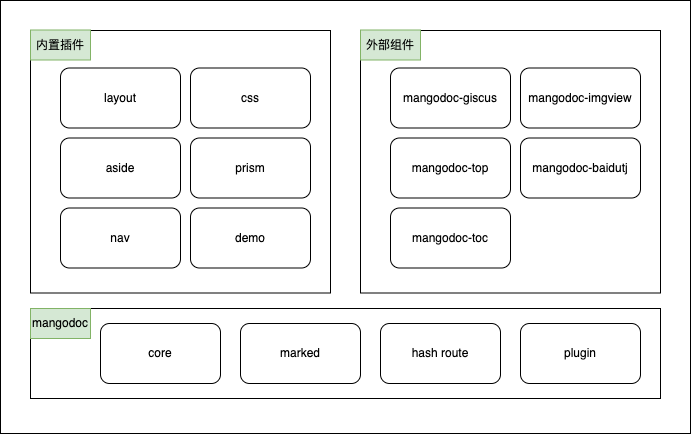

# mangodoc
一个简单的doc文档构建器，参考[docsify](https://docsify.js.org/#/zh-cn/)和[chatGPT](https://chat.openai.com/chat)。

[在线demo](https://mg0324.github.io/mangodoc/)



## 特性
* 基于`javascript`实现的简单文档生成器。
* 基于`marked`实现`markdown`到`html`的转换。
* 基于[elementui](https://element.eleme.cn/#/zh-CN/component/installation)的vue组件版本构建。
* 基于`es6`中的`fetch()`加上`window.location.hash`实现路由。
* 支持静态资源部署，如`gitee pages`、`github pages`等。
* 提供插件API接口，包括生命周期和部分事件监听函数。

## 插件列表
* 内置插件core - 支持文档布局、文档核心、hash路由、加载提示及插件机制
* 内置插件css - 支持内置样式嵌入
* 内置插件aside - 支持左侧目录栏配置和生成
* 内置插件nav - 支持顶部导航条配置和生成
* 内置插件prism - 基于`prismjs`支持代码高亮
* 外部插件[mangodoc-giscus](https://github.com/mg0324/mangodoc-giscus) - 支持giscus评论
* 外部插件[mangodoc-toc](https://github.com/mg0324/mangodoc-toc) - 支持文章目录书签生成
* 外部插件[mangodoc-imgview](https://github.com/mg0324/mangodoc-imgview) - 集成`hammerjs`支持图片点击查看和放大移动
* 外部插件[mangodoc-top](https://github.com/mg0324/mangodoc-top) - 支持文章阅读时返回顶部

## 快速开始
1. 创建index.html页
``` html
<!DOCTYPE html>
<html lang="en">
  <head>
    <meta charset="UTF-8">
    <title>mangodoc</title>
    <meta http-equiv="X-UA-Compatible" content="IE=edge,chrome=1" />
    <meta name="description" content="Description">
    <meta name="viewport" content="width=device-width, initial-scale=1.0, minimum-scale=1.0">
    <meta name="renderer" content="webkit">
    <link rel="stylesheet" href="https://unpkg.com/element-ui/lib/theme-chalk/index.css">
    <!-- 让IE8/9支持媒体查询，从而兼容栅格 -->
    <!--[if lt IE 9]>
        <script src="https://cdn.staticfile.org/html5shiv/r29/html5.min.js"></script>
        <script src="https://cdn.staticfile.org/respond.js/1.4.2/respond.min.js"></script>
    <![endif]-->
  </head>
  <body>
    <div id="vue"></div>
    <script>
        window.$mangodoc = {
            title: 'mangodoc',
            repo: 'https://github.com/mg0324/mangodoc',
            footer: '<span>mango mei &copy; 2023</span> @ copyright'
        };
    </script>
    <script src="https://unpkg.com/vue@2/dist/vue.js"></script>
    <script src="https://unpkg.com/element-ui/lib/index.js"></script>
    <script src="https://cdn.jsdelivr.net/npm/mangodoc@1.0.0/dist/mangodoc.min.js"></script>    
  </body>
</html>
```
2. 创建`docs`文件夹，且文件目录如下
```
- docs
|----_navbar.json # 导航栏配置
|----_sidebar.json # 左侧菜单配置
README.md # 主页
... 其他文档
```
3. 运行静态资源服务器，如`http-server`
``` shell
npm install -g http-server
http-server
```
4. 启动后，访问`localhost:8080`即可。


## java代码高亮
``` java
import java.sql.*;

/**
 * @Author: mango
 * @Date: 2022/12/31 7:58 PM
 */
public class App {
    public static void main(String[] args) throws ClassNotFoundException, SQLException {
        // 1. 加载驱动
        Class.forName("com.mysql.jdbc.Driver");
        // 2. 获取链接
        Connection connection = DriverManager.getConnection("jdbc:mysql://127.0.0.1:33306/url_function?useUnicode=true&characterEncoding=UTF-8",
                "root", "123456");
        // 3. 执行sql
        PreparedStatement preparedStatement = connection.prepareStatement("select * from t_user");
        ResultSet resultSet = preparedStatement.executeQuery();
        while (resultSet.next()){
            String userId = resultSet.getString("userId");
            String userName = resultSet.getString("userName");
            String email = resultSet.getString("email");
            String phone = resultSet.getString("phone");
            System.out.println("userId="+userId+",userName="+userName+",email="+email+",phone="+phone);
        }
        // 4. 关闭链接资源
        connection.close();
    }
}
```
